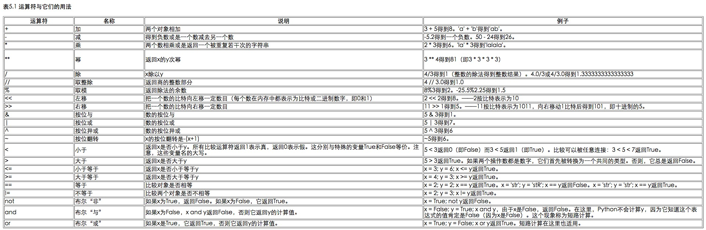
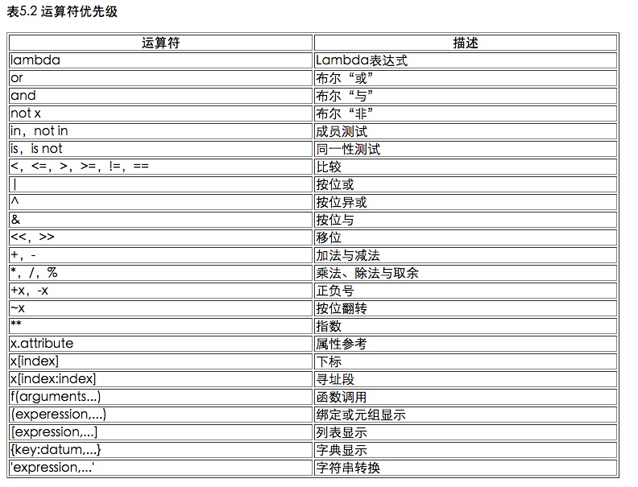

##Python学习笔记之简明Python教程快速学习（一）

#####From JiaYing.Cheng

---
---

###1. 介绍
Python是一种简单易学，功能强大的编程语言，它有高效率的高层数据结构，简单而有效地实现面向对象编程。Python简洁的语法和对动态输入的支持，再加上解释性语言的本质，使得它在大多数平台上的许多领域都是一个理想的脚本语言，特别适用于快速的应用程序开发。

###2. 最初的步骤
######HelloWord

```
#!/usr/bin/python
# Filename : helloworld.py
print 'hello world'
```

让我们思考一下这个程序的前两行。它们被称作 注释 ——任何在#符号右面的内容都是注释。注释主要作为提供给程序读者的笔记。

Python至少应当有第一行那样的特殊形式的注释。它被称作 组织行 ——源文件的头两个字符是#!，后面跟着一个程序。这行告诉你的Linux/Unix系统当你 执行 你的程序的时候，它应该运行哪个解释器。

```
$ python helloworld.py
Hello World
```

***重要***
在你的程序中合理地使用注释以解释一些重要的细节——这将有助于你的程序的读者轻松地理解程序在干什么。记住，这个读者可能就是6个月以后的你！

######可执行的Python程序

这部分内容只对Linux/Unix用户适用，不过Windows用户可能也对程序的第一行比较好奇。首先我们需要通过chmod命令，给程序可执行的许可，然后运行程序。

```
$ chmod a+x helloworld.py
$ ./helloworld.py
Hello World
```

***提示***
对于Python来说，程序、脚本或者软件都是指同一个东西。


###3. 基本概念
######字面意义上的常量

一个字面意义上的常量的例子是如同5、1.23、9.25e-3这样的数，或者如同'This is a string'、"It's a string!"这样的字符串。它是一个常量，因为不能改变它的值。

######数

在Python中有4种类型的数——整数、长整数、浮点数和复数。

- 3.23和52.3E-4是浮点数的例子。E标记表示10的幂。在这里，52.3E-4表示52.3 *10^(-4)。
-  (-5+4j)和(2.3-4.6j)是复数的例子。

######字符串
我几乎可以保证你在每个Python程序中都要用到字符串，所以请特别留心下面这部分的内容。下面告诉你如何在Python中使用字符串。

- **使用单引号（'）**  
你可以用单引号指示字符串，就如同'Quote me on this'这样。所有的空白，即空格和制表符都照原样保留。

- **使用双引号（"）**-  
在双引号中的字符串与单引号中的字符串的使用完全相同，例如"What's your name?"。

- **使用三引号（'''或"""）**-  
利用三引号，你可以指示一个多行的字符串。你可以在三引号中自由的使用单引号和双引号。例如：

```
'''This is a multi-line string. This is the first line.
This is the second line.
"What's your name?," I asked.
He said "Bond, James Bond."
'''
```
- **转义符**  
假设你想要在一个字符串中包含一个单引号（'），那么你该怎么指示这个字符串？例如，这个字符串是What's your name?。你肯定不会用'What's your name?'来指示它，因为Python会弄不明白这个字符串从何处开始，何处结束。所以，你需要指明单引号而不是字符串的结尾。可以通过 转义符 来完成这个任务。你用\'来指示单引号——注意这个反斜杠。现在你可以把字符串表示为'What\'s your name?'。

	另一个表示这个特别的字符串的方法是"What's your name?"，即用双引号。类似地，要在双引号字符串中使用双引号本身的时候，也可以借助于转义符。另外，你可以用转义符\\来指示反斜杠本身。

	值得注意的一件事是，在一个字符串中，行末的单独一个反斜杠表示字符串在下一行继续，而不是开始一个新的行。例如：

	```
"This is the first sentence.\
 This is the second sentence."
```
等价于

	```
"This is the first sentence. This is the second sentence."
```

- **自然字符串**  
如果你想要指示某些不需要如转义符那样的特别处理的字符串，那么你需要指定一个自然字符串。自然字符串通过给字符串加上前缀r或R来指定。例如r"Newlines are indicated by \n"。

- **Unicode字符串**  
Unicode是书写国际文本的标准方法。如果你想要用你的母语如北印度语或阿拉伯语写文本，那么你需要有一个支持Unicode的编辑器。类似地，Python允许你处理Unicode文本——你只需要在字符串前加上前缀u或U。例如，u"This is a Unicode string."。

	记住，在你处理文本文件的时候使用Unicode字符串，特别是当你知道这个文件含有用非英语的语言写的文本。

- **字符串是不可变的**  
这意味着一旦你创造了一个字符串，你就不能再改变它了。虽然这看起来像是一件坏事，但实际上它不是。我们将会在后面的程序中看到为什么我们说它不是一个缺点。

- **按字面意义级连字符串**  
如果你把两个字符串按字面意义相邻放着，他们会被Python自动级连。例如，'What\'s' 'your name?'会被自动转为"What's your name?"。

######变量
变量只是你的计算机中存储信息的一部分内存。与字面意义上的常量不同，你需要一些能够访问这些变量的方法，因此你给变量名字。

######标识符的命名

变量是标识符的例子。 标识符 是用来标识 某样东西 的名字。在命名标识符的时候，你要遵循这些规则：

- 标识符的第一个字符必须是字母表中的字母（大写或小写）或者一个下划线（‘ _ ’）。

- 标识符名称的其他部分可以由字母（大写或小写）、下划线（‘ _ ’）或数字（0-9）组成。

- 标识符名称是对大小写敏感的。例如，myname和myName不是一个标识符。注意前者中的小写n和后者中的大写N。

- 有效标识符名称的例子有i、__my_name、name_23和a1b2_c3。

- 无效标识符名称的例子有2things、this is spaced out和my-name。

######数据类型

变量可以处理不同类型的值，称为数据类型。基本的类型是数和字符串

######对象

记住，Python把在程序中用到的任何东西都称为 对象 。这是从广义上说的。因此我们不会说“某某 东西 ”，我们说“某个 对象 ”。

***给面向对象编程用户的注释***

```
就每一个东西包括数、字符串甚至函数都是对象这一点来说，Python是极其完全地面向对象的。
```

### 4. 运算符与表达式

######运算符



######运算符优先级



- **计算顺序**

	默认地，运算符优先级表决定了哪个运算符在别的运算符之前计算。然而，如果你想要改变它们的计算顺序，你得使用圆括号。例如，你想要在一个表达式中让加法在乘法之前计算，那么你就得写成类似(2 + 3) * 4的样子。

- **结合规律**

	运算符通常由左向右结合，即具有相同优先级的运算符按照从左向右的顺序计算。例如，2 + 3 + 4被计算成(2 + 3) + 4。一些如赋值运算符那样的运算符是由右向左结合的，即a = b = c被处理为a = (b = c)。
	
### 5. 控制流
######if语句

if语句用来检验一个条件， 如果 条件为真，我们运行一块语句（称为 if-块 ）， 否则 我们处理另外一块语句（称为 else-块 ）。 else 从句是可选的。

```
 #!/usr/bin/python
 # Filename: if.py 

number = 23
guess = int(raw_input('Enter an integer : '))

if guess == number:
    print 'Congratulations, you guessed it.' # New block starts here
    print "(but you do not win any prizes!)" # New block ends here
elif guess < number:
    print 'No, it is a little higher than that' # Another block
    # You can do whatever you want in a block ...
else:
    print 'No, it is a little lower than that' 
    # you must have guess > number to reach here

print 'Done'
 # This last statement is always executed, after the if statement is executed
```

######while语句

只要在一个条件为真的情况下，while语句允许你重复执行一块语句。while语句是所谓 循环 语句的一个例子。while语句有一个可选的else从句。

```
 #!/usr/bin/python
 # Filename: while.py

number = 23
running = True

while running:
    guess = int(raw_input('Enter an integer : '))

    if guess == number:
        print 'Congratulations, you guessed it.' 
        running = False # this causes the while loop to stop
    elif guess < number:
        print 'No, it is a little higher than that' 
    else:
        print 'No, it is a little lower than that' 
else:
    print 'The while loop is over.' 
    # Do anything else you want to do here

print 'Done'
```

当while循环条件变为False的时候，else块才被执行——这甚至也可能是在条件第一次被检验的时候。如果while循环有一个else从句，它将始终被执行，除非你的while循环将永远循环下去不会结束！

**True和False被称为布尔类型。你可以分别把它们等效地理解为值1和0。在检验重要条件的时候，布尔类型十分重要，它们并不是真实的值1。**

else块事实上是多余的，因为你可以把其中的语句放在同一块（与while相同）中，跟在while语句之后，这样可以取得相同的效果。

######for循环

for..in是另外一个循环语句，它在一序列的对象上 递归 即逐一使用队列中的每个项目。

```
 #!/usr/bin/python
 # Filename: for.py

for i in range(1, 5):
    print i
else:
    print 'The for loop is over'
```

for循环在这个范围内递归——for i in range(1,5)等价于for i in [1, 2, 3, 4]，这就如同把序列中的每个数（或对象）赋值给i，一次一个，然后以每个i的值执行这个程序块。在这个例子中，我们只是打印i的值。

记住，else部分是可选的。如果包含else，它总是在for循环结束后执行一次，**除非遇到break语句**。

记住，for..in循环对于任何序列都适用。这里我们使用的是一个由内建range函数生成的数的列表，但是广义说来我们可以使用任何种类的由任何对象组成的序列！

######break语句

break语句是用来 终止 循环语句的，即哪怕循环条件没有称为False或序列还没有被完全递归，也停止执行循环语句。

一个重要的注释是，如果你从for或while循环中 终止 ，任何对应的循环else块将不执行。

```
 #!/usr/bin/python
 # Filename: break.py

while True:
    s = raw_input('Enter something : ')
    if s == 'quit':
        break
    print 'Length of the string is', len(s)
print 'Done'
```

######continue语句

continue语句被用来告诉Python跳过当前循环块中的剩余语句，然后 继续 进行下一轮循环。

###6. 函数
函数是重用的程序段。它们允许你给一块语句一个名称，然后你可以在你的程序的任何地方使用这个名称任意多次地运行这个语句块。这被称为 调用 函数。

函数通过def关键字定义。def关键字后跟一个函数的 标识符 名称，然后跟一对圆括号。圆括号之中可以包括一些变量名，该行以冒号结尾。接下来是一块语句，它们是函数体。

```
 #!/usr/bin/python
 # Filename: function1.py

def sayHello():
    print 'Hello World!' # block belonging to the function

sayHello() # call the function
```

######函数形参
函数取得的参数是你提供给函数的值，这样函数就可以利用这些值 做 一些事情。这些参数就像变量一样，只不过它们的值是在我们调用函数的时候定义的，而非在函数本身内赋值。

参数在函数定义的圆括号对内指定，用逗号分割。当我们调用函数的时候，我们以同样的方式提供值。注意我们使用过的术语——函数中的参数名称为 形参 而你提供给函数调用的值称为 实参 。

######局部变量
当你在函数定义内声明变量的时候，它们与函数外具有相同名称的其他变量没有任何关系，即变量名称对于函数来说是 局部 的。这称为变量的 作用域 。所有变量的作用域是它们被定义的块，从它们的名称被定义的那点开始。

**使用global语句**

如果你想要为一个定义在函数外的变量赋值，那么你就得告诉Python这个变量名不是局部的，而是 全局 的。我们使用global语句完成这一功能。**没有global语句，是不可能为定义在函数外的变量赋值的**。

你可以使用定义在函数外的变量的值（假设在函数内没有同名的变量）。然而，我并不鼓励你这样做，并且你应该尽量避免这样做，因为这使得程序的读者会不清楚这个变量是在哪里定义的。**使用global语句可以清楚地表明变量是在外面的块定义的**。

```
 #!/usr/bin/python
 # Filename: func_global.py

def func():
    global x

    print 'x is', x
    x = 2
    print 'Changed local x to', x

x = 50
func()
print 'Value of x is', x
```

######默认参数值

对于一些函数，你可能希望它的一些参数是 可选 的，如果用户不想要为这些参数提供值的话，这些参数就使用默认值。这个功能借助于默认参数值完成。你可以在函数定义的形参名后加上赋值运算符（=）和默认值，从而给形参指定默认参数值。

注意，默认参数值应该是一个参数。更加准确的说，默认参数值应该是不可变的——这会在后面的章节中做详细解释。从现在开始，请记住这一点。

```
 #!/usr/bin/python
 # Filename: func_default.py

def say(message, times = 1):
    print message * times

say('Hello')
say('World', 5)
```

**重要**

```
只有在形参表末尾的那些参数可以有默认参数值，即你不能在声明函数形参的时候，先声明有默认值的形参而后声明没有默认值的形参。
这是因为赋给形参的值是根据位置而赋值的。例如，def func(a, b=5)是有效的，但是def func(a=5, b)是 无效 的。
```

######关键参数
如果你的某个函数有许多参数，而你只想指定其中的一部分，那么你可以通过命名来为这些参数赋值——这被称作 关键参数 ——我们使用名字（关键字）而不是位置（我们前面所一直使用的方法）来给函数指定实参。

这样做有两个 优势 ——一，由于我们不必担心参数的顺序，使用函数变得更加简单了。二、假设其他参数都有默认值，我们可以只给我们想要的那些参数赋值。

```
 #!/usr/bin/python
 # Filename: func_key.py

def func(a, b=5, c=10):
    print 'a is', a, 'and b is', b, 'and c is', c

func(3, 7)
func(25, c=24)
func(c=50, a=100)
```

######return语句

return语句用来从一个函数 返回 即跳出函数。我们也可选从函数 返回一个值 。

**注意，没有返回值的return语句等价于return None。**None是Python中表示没有任何东西的特殊类型。例如，如果一个变量的值为None，可以表示它没有值。

**除非你提供你自己的return语句，每个函数都在结尾暗含有return None语句。**通过运行print someFunction()，你可以明白这一点，函数someFunction没有使用return语句，如同：

```
def someFunction():
    pass
```
pass语句在Python中表示一个空的语句块。

######DocStrings

Python有一个很奇妙的特性，称为 文档字符串 ，它通常被简称为 docstrings 。DocStrings是一个重要的工具，由于它帮助你的程序文档更加简单易懂，你应该尽量使用它。你甚至可以在程序运行的时候，从函数恢复文档字符串！

```
 #!/usr/bin/python
 # Filename: func_doc.py

def printMax(x, y):
    '''Prints the maximum of two numbers.

    The two values must be integers.'''
    x = int(x) # convert to integers, if possible
    y = int(y)

    if x > y:
        print x, 'is maximum'
    else:
        print y, 'is maximum'

printMax(3, 5)
print printMax.__doc__
```
文档字符串的惯例是一个多行字符串，它的首行以大写字母开始，句号结尾。第二行是空行，从第三行开始是详细的描述。 强烈建议 你在你的函数中使用文档字符串时遵循这个惯例。

你可以使用\__doc__（注意双下划线）调用printMax函数的文档字符串属性（属于函数的名称）。请记住Python把 每一样东西 都作为对象，包括这个函数。

如果你已经在Python中使用过help()，那么你已经看到过DocStings的使用了！它所做的只是抓取函数的__doc__属性，然后整洁地展示给你。你可以对上面这个函数尝试一下——只是在你的程序中包括help(printMax)。记住按q退出help。

自动化工具也可以以同样的方式从你的程序中提取文档。因此，我强烈建议 你对你所写的任何正式函数编写文档字符串。随你的Python发行版附带的pydoc命令，与help()类似地使用DocStrings。